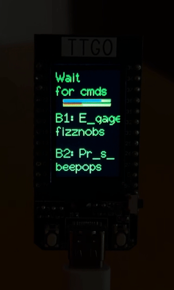

# Microcontroller Distributed System Spaceteam

Spaceteam is a multiplayer game designed for an ESP32 microcontroller that uses the ESPNOW protocol where players must cooperate to completing various tasks in order to fix their ship and progress through levels. Players communicate
with one another to convey the different tasks that need to be done, and the person with the task available will press the corresponding button to complete the task. We wanted to build on the Spaceteam implementation found [here](https://github.com/ttseng/COMS3930-Fall2024/blob/main/Module%203/espaceteam.ino)

*Here's a video of the game in action: https://youtube.com/shorts/rJZeuQ00o0s?feature=share*

## Blog Post

You can take an in depth look at our process making this game in this blog [post](https://brassy-moonflower-6cd.notion.site/Slice-and-Spice-S2-12d18fb9102d80a786a9e72461ec0fd8?pvs=4)

## Table of Contents

- [Materials](#what-youll-need)

## What You'll Need
 + [Arduino IDE](https://www.arduino.cc/en/software)
 + [USB-C Cable](https://www.amazon.com/3-Pack-Charging-Compatible-Max%EF%BC%8CSamsung-MacBook/dp/B0C5DFLGZG/ref=sr_1_1_sspa?crid=1J4HMA8LN1V72&dib=eyJ2IjoiMSJ9._xXfHeYXKMA7uaVBojUx7_ztgfErVtQfGS9iKfENhIyM9fyMpbyxRjvtii0Tf4yjlhaQorsdAM6MqPXO7kg06HKjPVVsh_zgFfSz_lB3Mujs5SBqXuGu7unNou_67eJjPteECmqSqyQJ-3WuGb6hDoa6s259xWDlp3RHbFOKcesy0UrPyKvBnMEjzk1GGAZ03Xwczrl-2dIli56iUuHxdmXsHH5k_THtTmGIfckcIjEGKF9nE6xFW9s3R97vA62yXXxH0ugyjIF7hv7GUWTFIyp28Rhv76XkCkyQ2eFJeZs.HRGVQ5v8xi7RDidmZ1ULkysSISZY84_s3ymlprYzKoQ&dib_tag=se&keywords=usb+c+cable&qid=1730077700&s=industrial&sprefix=usb+c+cable%2Cindustrial%2C101&sr=1-1-spons&sp_csd=d2lkZ2V0TmFtZT1zcF9hdGY&psc=1)
 + [More Than One ESP32 TTGO T-display Microcontroller](https://www.amazon.com/LILYGO-T-Display-Arduino-Development-CH9102F/dp/B099MPFJ9M?th=1)

## Installation
To play the game, you need at least 2 ESP32 displays within close range to one another (around 220 meters)

## Design Goals
- Implement an upgraded timer that causes a game over when expired
- Erase random letters to make the game progressively more difficult
- Added level up and game over screens
- Restarting the game when over

https://github.com/user-attachments/assets/83cf9d13-7d10-4751-9e9d-795be9a7f96e

https://github.com/user-attachments/assets/53e23620-4f81-429a-8b57-224842b80c5d
