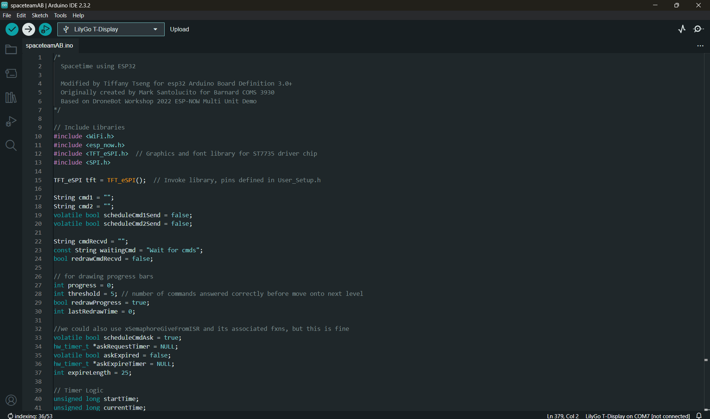
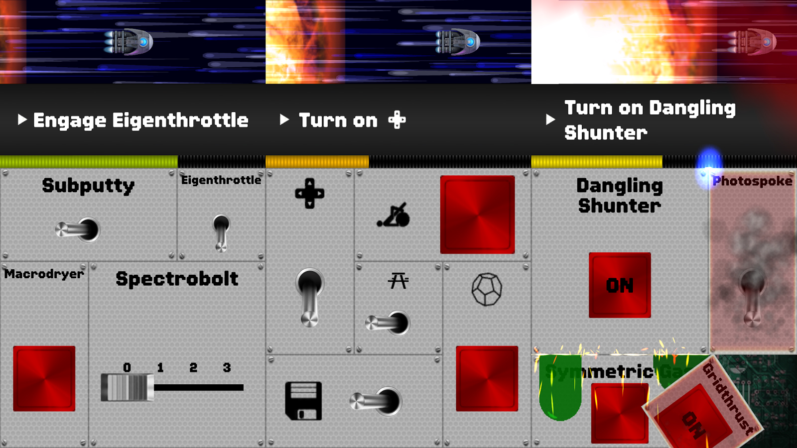

# Microcontroller Distributed System Spaceteam

Spaceteam is a multiplayer game designed for an ESP32 microcontroller that uses the ESPNOW protocol where players must cooperate to completing various tasks in order to fix their ship and progress through levels. Players communicate
with one another to convey the different tasks that need to be done, and the person with the task available will press the corresponding button to complete the task. We wanted to build on the Spaceteam implementation found [here](https://github.com/ttseng/COMS3930-Fall2024/blob/main/Module%203/espaceteam.ino)

*Here's a video of the game in action: https://youtube.com/shorts/rJZeuQ00o0s?feature=share*

## Blog Post

You can take an in depth look at our process making this game in this blog [post](https://brassy-moonflower-6cd.notion.site/Slice-and-Spice-S2-12d18fb9102d80a786a9e72461ec0fd8?pvs=4)

## Table of Contents

- [Materials](#what-youll-need)
- [Installation Process](#installation)
- [Design Process](#design-process-and-goals)

## What You'll Need
 + [Arduino IDE](https://www.arduino.cc/en/software)
 + [USB-C Cable](https://www.amazon.com/3-Pack-Charging-Compatible-Max%EF%BC%8CSamsung-MacBook/dp/B0C5DFLGZG/ref=sr_1_1_sspa?crid=1J4HMA8LN1V72&dib=eyJ2IjoiMSJ9._xXfHeYXKMA7uaVBojUx7_ztgfErVtQfGS9iKfENhIyM9fyMpbyxRjvtii0Tf4yjlhaQorsdAM6MqPXO7kg06HKjPVVsh_zgFfSz_lB3Mujs5SBqXuGu7unNou_67eJjPteECmqSqyQJ-3WuGb6hDoa6s259xWDlp3RHbFOKcesy0UrPyKvBnMEjzk1GGAZ03Xwczrl-2dIli56iUuHxdmXsHH5k_THtTmGIfckcIjEGKF9nE6xFW9s3R97vA62yXXxH0ugyjIF7hv7GUWTFIyp28Rhv76XkCkyQ2eFJeZs.HRGVQ5v8xi7RDidmZ1ULkysSISZY84_s3ymlprYzKoQ&dib_tag=se&keywords=usb+c+cable&qid=1730077700&s=industrial&sprefix=usb+c+cable%2Cindustrial%2C101&sr=1-1-spons&sp_csd=d2lkZ2V0TmFtZT1zcF9hdGY&psc=1)
 + [More Than One ESP32 TTGO T-display Microcontroller](https://www.amazon.com/LILYGO-T-Display-Arduino-Development-CH9102F/dp/B099MPFJ9M?th=1)

## Installation
To play the game, you need at least 2 ESP32 displays within close range to one another (*around 220 meters*)
1. Download the `spaceteamAB` folder and open arduino sketch file inside named `spaceteamAB.ino` on Arduino IDE
    * If Arduino IDE is not installed, check the [Arduino Support Page](https://support.arduino.cc/hc/en-us/articles/360019833020-Download-and-install-Arduino-IDE) to learn how to install it

2. Once everything is set up, you can connect your ESP32 to your computer via USB-C and click on the `Upload` sketch button on the top left of the Arduino IDE after selecting your board and appropriate configurations. This will make the code compile and store onto the ESP32.

3. Repeat previous step for the rest of the ESP32 microcontrollers you plan to use in the game and once they all have the game loaded, reset all of them at the same time to start a new game together.

## Design Process and Goals

This game reference is the inspiration behind this ESP32 multiplayer game that depicts a set of controls coordinated by the players in the game through communicating the tasks they must complete on each of their screens.

- Game Inspiration Reference:

  

- Implement an upgraded timer that causes a game over when expired
- Erase random letters to make the game progressively more difficult
- Added level up and game over screens
- Restarting the game when over

https://github.com/user-attachments/assets/83cf9d13-7d10-4751-9e9d-795be9a7f96e

https://github.com/user-attachments/assets/53e23620-4f81-429a-8b57-224842b80c5d
